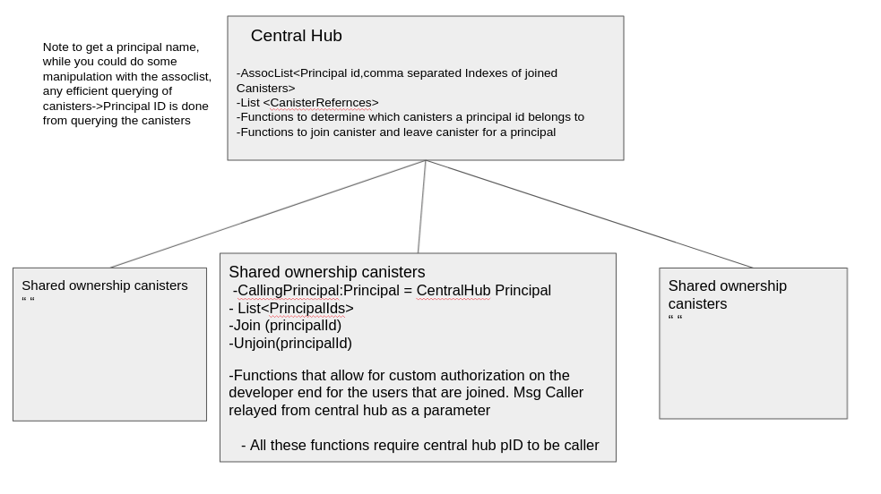

# Summary 

An example program of using a central hub to call more intensive data storage and computational tasks across individual canisters. The Central hub also will create these new canisters.

The project reaches goal 1: Primary canister provides indexing information such that a client can distribute prallel calls across secondary canisters directly. 

Prinicpal Id's check in as msg.caller and call to a respective canister they are part of and the primary canister relays the calls to respective canister

The project reaches goal 2:Provide a security interface such that secondary canisters can hold private data from many users but only deliver requests to authorized requesters. Attempt to use as few inter-canister calls as possible. 

Functions of secondary canisters have functions of various access/authorization including holding private data and delivering requests to users.


## Running the project locally

Make sure you have dfx installed 
If you want to test your project locally, you can use the following commands:

```bash
# Starts the replica, running in the background
dfx start --background

# Deploys your canisters to the replica and generates your candid interface
dfx deploy main 
```

