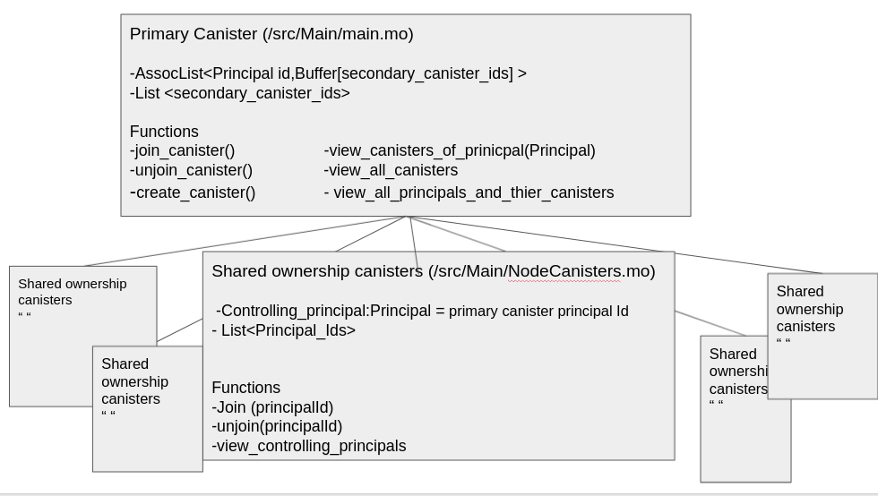
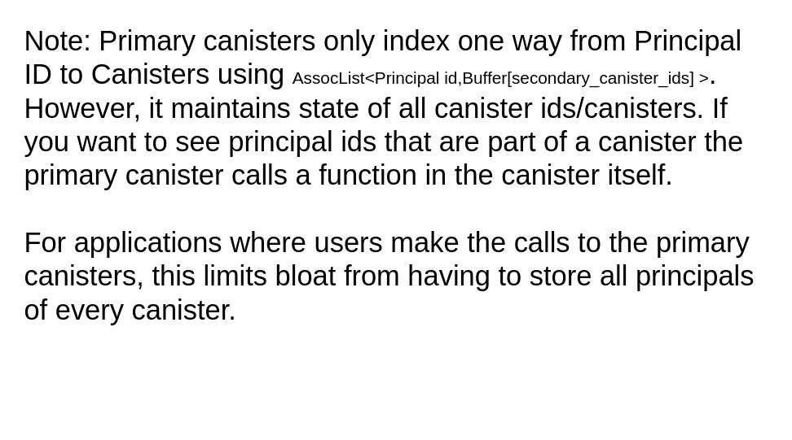

# Summary: Shared ownerships of Canisters with the purpose of fullfilling the scaling bounty





The purpose of this project is to create canisters that have shared ownership. However, this is different than allowing multiple canisters to have control of the canister in the default sense. The problem is some default canister functions give full access to anyone with control (ie. there is only one level of control). A quick analogy is in a joint bank account from bank, you can have a married couple with each of their name on it but each party is able to completely withdraw funds. In a divorce, things can become messy if one party decides to withdraw everything quickly since both parties have full control. Instead, it would be nice to create a joint bank account where maybe people can vote on money spent, split evenly the amounts, divy up the percentage owned etc. In essence if the default settings for multiple users with control over a canister is like a legacy joint bank account,this program is meant to create extra sharing functionality for canisters! 

I achieve this by creating a priary canister that creates canisters. This canister retains default control of the new canisters and any customized ownership is kept track in a list in the secondary canisters. Users interface with the secondary canisters through method calls from the the primary one. Essentially, the primary canister has an  assoclist (dictionary) that has the users principal ids as a key and a buffer of secondary ids per principal id. This achieves project goal 1.

Primary canister provides indexing information such that a client can distribute prallel calls across secondary canisters directly. 


principalids/users can join and unjoin secondary canisters as they please. (However, custom membership, limiting number of principal ids/users, etc. can be added). For now it is just join and unjoin.  However, actual calling of canisters isnt from the the principalids/users themselves but from the primary canister. If we remove all control from the primary canister after enough development, the system can be quite trustless as default control would be essentially "black holed". This achieves project goal 2.  

Provide a security interface such that secondary canisters can hold private data from many users but only deliver requests to authorized requesters. Attempt to use as few inter-canister calls as possible. 

TO SEE CODES STRUCTURE SEE DIAGRAMS AT TOP OF PAGE. Essentially, main.mo is the primary canister, and it creates many instances of NodeCanisters (NodeCanisters.mo).
These live in /src/Main directory.

## Running the project locally

Make sure you have dfx installed 
If you want to test your project locally, you can use the following commands:

```bash
# Starts the replica, running in the background
dfx start --background

# Deploys your canisters to the replica and generates your candid interface
dfx deploy 
```

Lets start messing with the functions. First call the primary canister to create a new canister. The output is the principal ids that have membership of the created canister. Note, creating a canister automatically has you join that secondary canister 
```bash
#Create a canister from the primary canister 
dfx canister call main create_canister
```

Now view the canister indexing data structure it is a principal id -> [secondary canister id,] assoclist (dictionary)
```bash
dfx canister call main view_principals_and_canisters
```

You should be able to see your principal id with the created secondary canister. To show that the primary canister actually retains default control type in 
```bash
dfx canister call main view_canister_statuses
```

Asy you can see, the controller is not your principal ID but the primary one...Wait! I thought I get control. You do but its custom based on the secondary canister code/rules! The primary canister prevents anyone from holding default control. 
Type in the bottom command to view the canisters that you are apart of
```bash
dfx canister call main view_canisters_ids_of_caller
```

Now type in below. Note the primary canister DOES NOT INDEX the principals that have membership in each canister. Instead it calls that specific canister and recieves this information. PLEASE IN THE BRACKETS REPLACE WITH THE CANISTER ID THAT SHOWED UP FROM LAST COMMAND
```bash
dfx canister call main view_principals_of_canister '(principal "<the canister id indexed>" )'
```

Now create another identity and then use it
```bash
dfx identity new new-identity
dfx identity use new-identity
dfx identity get-principal
```

Now lets create another canister, view the indexing dictionary again 
```bash
dfx canister call main create_canister
dfx canister call main view_principals_and_canisters
```
 
You can join and unjoin canisters. This functionality again is maintained from the secondry canisters but relayed through the primary canister to keep track of principal ids that are involved and again to remove middleman default ownership. View the canisters you are apart of and unjoin it.
```bash
dfx canister call main view_canisters_ids_of_caller
```

again SUBSTITUTE THE OUTPUT OF THE CANISTER ID THAT YOU HAVE MEMBERSHIP WITH THE BRACKETS. Note the output should be the principal ids that are members of the canister. Here, there are none. 
```bash
dfx canister call main unjoin_canister '(principal "<the sole canister that you are apart of>")'
```

```bash
dfx canister call main view_principals_and_canisters
```

As you can see, youre no longer part of any canister and any functionality the secondary canister states, you may not have access to.
Anyway, lets join the canister of the first user

```bash
dfx canister call main view_principals_and_canisters
```

take any of the canisters the first user is apart of and join it
```bash
dfx canister call main join_canister '(principal "<that principal id>")
```


## Licenscing 

Begin license text.
Copyright 2022 Albert Du 

Permission is hereby granted, free of charge, to any person obtaining a copy of this software and associated documentation files (the "Software"), to deal in the Software without restriction, including without limitation the rights to use, copy, modify, merge, publish, distribute, sublicense, and/or sell copies of the Software, and to permit persons to whom the Software is furnished to do so, subject to the following conditions:

The above copyright notice and this permission notice shall be included in all copies or substantial portions of the Software.

THE SOFTWARE IS PROVIDED "AS IS", WITHOUT WARRANTY OF ANY KIND, EXPRESS OR IMPLIED, INCLUDING BUT NOT LIMITED TO THE WARRANTIES OF MERCHANTABILITY, FITNESS FOR A PARTICULAR PURPOSE AND NONINFRINGEMENT. IN NO EVENT SHALL THE AUTHORS OR COPYRIGHT HOLDERS BE LIABLE FOR ANY CLAIM, DAMAGES OR OTHER LIABILITY, WHETHER IN AN ACTION OF CONTRACT, TORT OR OTHERWISE, ARISING FROM, OUT OF OR IN CONNECTION WITH THE SOFTWARE OR THE USE OR OTHER DEALINGS IN THE SOFTWARE.

End license text.
